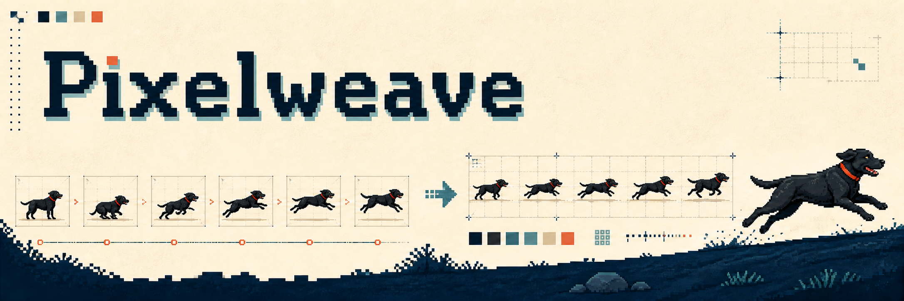

# Pixelweave



画像→動画を、ゲーム向けの安定したピクセルアート・スプライトシートへ変換する小さな再現可能パイプライン。

Image → MiniMax-H3 video → frame selection → common fit → Pixel Snapper → reference palette lock → chroma-key removal → sprite sheet → Aseprite

## サンプル

黒いラブラドールが走るアニメーションを1本、素材と完成品つきで収録している。

- [sample directory](examples/labrador-run/)
- [13-frame transparent sprite sheet](examples/labrador-run/artifacts/labrador_run_13frames_transparent_reference_palette.png)
- [Aseprite animation](examples/labrador-run/artifacts/labrador_run_13frames_reference_palette.aseprite)
- [MiniMax-H3 workflow](examples/labrador-run/minimax_h3_workflow_api.json)

## 特徴

- 39 native framesから、uniform / motion arc-length / loop seamで任意フレーム数へ削減
- 全フレームの共通foreground boxを使って、キャラの大きさ・足元・見切れを安定化
- 参照画像から抽出した固定パレットを全フレームに適用し、色のチカチカを抑制
- 緑背景を最後に透過化し、グリーンのエッジ汚染をdespill
- PNGスプライトシートとJSONメタデータを生成
- Aseprite CLIで本物のタイムライン付き`.aseprite`へ変換

## 必要環境

- Windows / PowerShell 5.1 or PowerShell 7
- Python 3.11+
- Pillow, PyAV
- MiniMax-H3が動くComfyUI（動画生成をする場合）
- Pixel Snapper (`spritefusion-pixel-snapper`)
- Aseprite（任意。編集可能なアニメーションを書き出す場合）

セットアップ:

```powershell
py -m venv .venv
\.venv\Scripts\Activate.ps1
python -m pip install -e ".[dev]"
```

## 使い方

MiniMax-H3のComfyUI APIワークフローで、640×640・39フレームの動画を先に生成する。プロンプトは[こちら](docs/prompting.md)の固定条件を使う。

動画から13フレームのスプライトシートを作る:

```powershell
.\scripts\run_postprocess.ps1 `
  -Video .\work\labrador_run_39frames_640.mp4 `
  -Reference .\examples\labrador-run\reference_640_green.png `
  -OutputDir .\work\labrador_run_processed `
  -TargetFrames 13 `
  -Strategy arc-length `
  -PixelSize 10 `
  -Colors 16 `
  -KeyColor 00ff00 `
  -SnapperPath 'C:\path\to\spritefusion-pixel-snapper.exe'
```

`-TargetFrames`は5、8、13などに変更できる。`-Strategy loop`はループのつなぎ目を探してからフレームを抜く。

Asepriteへ変換:

```powershell
.\scripts\run_aseprite_import.ps1 `
  -Sheet .\work\labrador_run_processed\sprite_sheet_transparent.png `
  -Output .\work\labrador_run_processed\labrador_run.aseprite `
  -Columns 13 `
  -FrameWidth 75 `
  -FrameHeight 73 `
  -FrameDurationMs 125
```

## 重要な設計

生成プロンプトでは、入力画像を「frame 0」と明示する。カメラ、キャラの高さ・幅、足元、背景色、safe rectangleを固定し、動かす部位だけを指定する。生成後は、色をフレームごとに再推定しない。参照画像から作った1つのパレットを全フレームに使う。

詳細は以下:

- [pipeline design](docs/pipeline.md)
- [prompting MiniMax-H3](docs/prompting.md)
- [palette and outline stability](docs/color-stability.md)

## 注意

MiniMax-H3は同じプロンプトでも出力が変わる。生成動画は素材として扱い、ゲーム投入前にフレームの足元、輪郭、首輪、透過エッジを確認すること。動画生成モデルの再現性を完全に保証するRepoではなく、後処理を再現可能にするRepo。

## License

MIT. MiniMax-H3、ComfyUI、Pixel Snapper、Asepriteはそれぞれのライセンスに従う。
