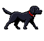

# Pixelweave


Pixelweave is a local, reproducible pipeline for turning a reference image and an image-to-video result into clean game-ready sprite frames, sprite sheets, and editable Aseprite animations.

`reference image → MiniMax-H3 video → native frames → motion-aware selection → common fit → pixel snap → shared palette → transparent PNGs → QC → sprite sheet → Aseprite`

## Live sample

The repository includes a 13-frame black Labrador running sample. The GIF is a preview; the transparent PNG sheet, frame sequence, QC report, and Aseprite file are the production artifacts.



- [Sample directory](examples/labrador-run/)
- [Transparent sprite sheet](examples/labrador-run/artifacts/labrador_run_13frames_transparent_reference_palette.png)
- [Aseprite animation](examples/labrador-run/artifacts/labrador_run_13frames_reference_palette.aseprite)
- [MiniMax-H3 workflow](examples/labrador-run/minimax_h3_workflow_api.json)

## What it solves

- Reduce a native 39-frame clip to any requested count such as 5, 8, or 13 with uniform, motion arc-length, or loop-aware selection.
- Keep a common foreground box and bottom anchor so the character does not grow, shrink, slide, or get cropped between frames.
- Use one palette extracted from the original reference to reduce color flicker and preserve outline colors.
- Normalize a chroma-key background before snapping, then remove it with optional despill.
- Inspect the actual frames with numeric quality gates and a labeled contact sheet. A smooth GIF can hide broken silhouettes, blur, duplicate frames, and loop-seam problems.
- Export a transparent sheet, JSON manifest, runtime atlas metadata, and an editable Aseprite timeline.

## Requirements

- Windows with PowerShell 5.1 or PowerShell 7
- Python 3.11+
- Pillow and PyAV
- A local ComfyUI installation with MiniMax-H3 for video generation
- [SpriteFusion Pixel Snapper](https://github.com/Hugo-Dz/spritefusion-pixel-snapper)
- Aseprite is optional and only needed for the editable animation handoff

```powershell
py -m venv .venv
.\.venv\Scripts\Activate.ps1
python -m pip install -e ".[dev]"
```

## Quick start

Generate a 640×640, 39-frame source video in ComfyUI. Use the [prompt profiles](prompts/animation_profiles.json) and the [MiniMax-H3 prompting guide](docs/prompting.md) to lock the first frame, safe rectangle, camera, subject scale, and action.

Then run the deterministic post-processing pipeline:

```powershell
.\scripts\run_postprocess.ps1 `
  -Video .\work\labrador_run_39frames_640.mp4 `
  -Reference .\examples\labrador-run\reference_640_green.png `
  -OutputDir .\work\labrador_run_processed `
  -TargetFrames 13 `
  -Strategy arc-length `
  -PixelSize 10 `
  -Colors 16 `
  -KeyColor 00ff00 `
  -SnapperPath 'C:\path\to\spritefusion-pixel-snapper.exe'
```

The output includes `quality_gate.json` and `quality_contact_sheet.png` before the final `sprite_sheet_transparent.png`. Use `-TargetFrames 5`, `8`, or another value when fewer or more gameplay frames are needed.

To create an editable Aseprite animation:

```powershell
.\scripts\run_aseprite_import.ps1 `
  -Sheet .\work\labrador_run_processed\sprite_sheet_transparent.png `
  -Output .\work\labrador_run_processed\labrador_run.aseprite `
  -Columns 13 `
  -FrameWidth 75 `
  -FrameHeight 73 `
  -FrameDurationMs 125
```

## Design notes

Keep the generated video and the game deliverables separate. H3 is responsible for readable motion; the deterministic stages enforce common framing, palette stability, transparent edges, frame count, and sheet layout. For a strict loop, pin frame 0 and require the last pose to return to it. For a more expressive action, allow anticipation, squash, stretch, overlap, and follow-through only inside the same safe rectangle.

See:

- [Pipeline design](docs/pipeline.md)
- [Prompt profiles and action benchmarks](docs/prompting.md)
- [Quality gates](docs/quality-gates.md)
- [Palette and outline stability](docs/color-stability.md)

## Japanese / 日本語

Pixelweaveは、参照画像と画像→動画の結果から、ゲーム用のスプライトフレーム、スプライトシート、Asepriteアニメーションをローカルで再現可能な形に整えるパイプラインだよ。

生成動画は素材として扱い、後処理で次を固定する設計になっている。

- 39フレームから5・8・13など任意の枚数へ削減
- 全フレーム共通の前景ボックスと足元アンカー
- 参照画像から抽出した固定パレット
- クロマキー正規化、透過化、デスピル
- フレーム単体のQCとコンタクトシート
- 透過スプライトシート、JSON、Aseprite

詳しい手順は[パイプライン設計](docs/pipeline.md)、[プロンプト](docs/prompting.md)、[品質ゲート](docs/quality-gates.md)を見てね。

## License

MIT. MiniMax-H3, ComfyUI, Pixel Snapper, and Aseprite remain subject to their own licenses.
